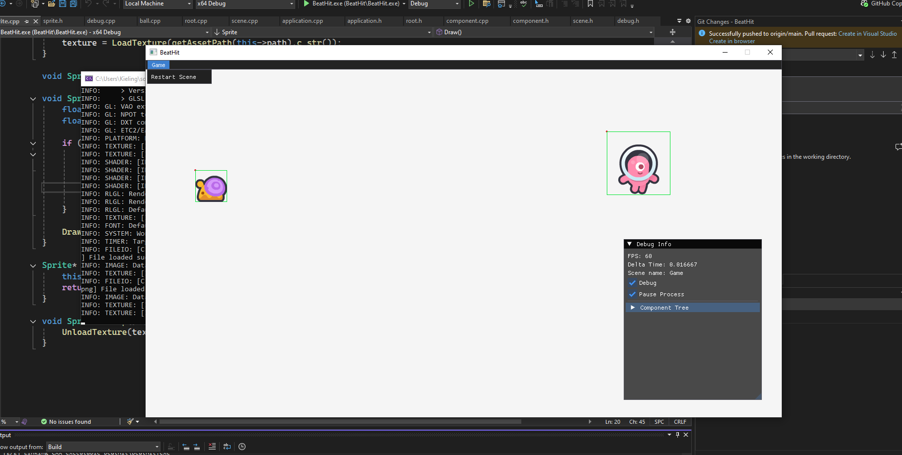

# BeatHit

A experiment of a game engine from scratch.

- Tile: Tiled Map Edit
- Graphics: Raylib

### TODO

- [x] Quad
- [x] Initial Component Sync
- [x] Initial Debug Panels
- [ ] Animation
- [ ] Moveable Player (idle, walk, jump)
- [x] Camera2D (follow player)
- [ ] Tileset Import
- [ ] Editor state extraction (and load)
